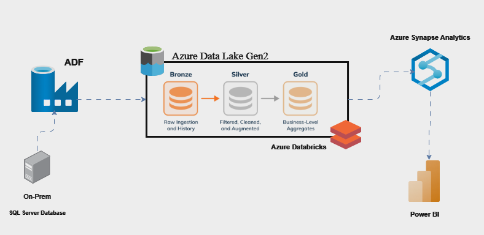
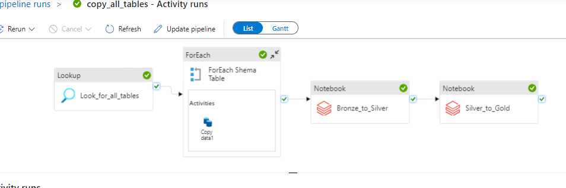
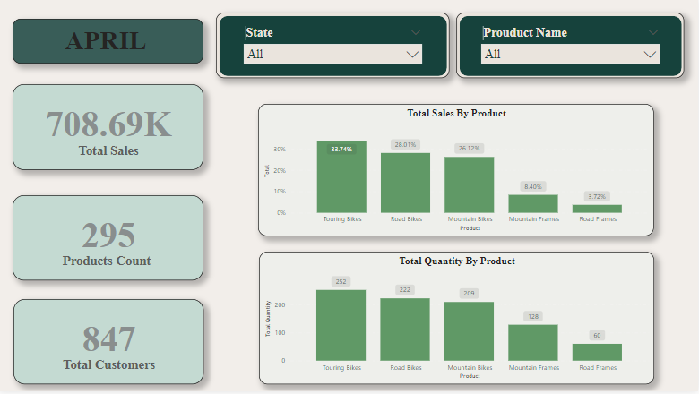

# Data Pipeline Project Using Azure Data Factory, Azure Databricks, and Azure Synapse

## Overview

This project involves building an end-to-end data pipeline using various Azure services, including **Azure Data Factory (ADF)**, **Azure Data Lake Gen2**, **Azure Databricks**, **Azure Synapse Analytics**, and **Power BI**. The pipeline extracts data from an on-premise SQL Server database, processes it using the Delta Lake architecture, and delivers business-ready insights.

## Architecture

### Key Components:
1. **Azure Data Factory (ADF)**
   - ADF is used for orchestrating the data pipeline. It automates data extraction from the on-premise SQL Server, performs data loading, and coordinates the different transformation steps.
   
2. **Azure Data Lake Gen2 (Bronze-Silver-Gold Architecture)**
   - **Bronze Layer**: Raw data ingestion from SQL Server.
   - **Silver Layer**: Cleaned, filtered, and augmented data.
   - **Gold Layer**: Aggregated data ready for analysis and reporting.

3. **Azure Databricks**
   - Responsible for performing transformations on the data. Data is processed in two main stages:
     - **Bronze to Silver**: Raw data is cleaned and standardized.
     - **Silver to Gold**: Cleaned data is aggregated and prepared for analytics.

4. **Azure Synapse Analytics**
   - Once the data is in the Gold layer, it is integrated with Synapse Analytics for efficient querying and analysis.

5. **Power BI**
   - The final business-level data is visualized in Power BI, providing insights and reporting for stakeholders.

## Pipeline Workflow

### Step 1: Data Extraction
- Data is extracted from an on-premise SQL Server database using **Azure Data Factory**. The pipeline captures metadata (such as table names) and dynamically loops through all tables.

### Step 2: Data Loading
- The data is ingested into **Azure Data Lake Gen2**. It follows a structured approach:
  - **Bronze Layer**: Raw ingested data is stored here for history and archiving.
  - **Silver Layer**: Data is cleaned and transformed.
  - **Gold Layer**: Data is aggregated and prepared for business intelligence (BI) purposes.

### Step 3: Data Transformation
- Using **Azure Databricks**, the data is transformed from raw form to structured formats (Bronze to Silver) and further into business aggregates (Silver to Gold).
- [Bronze To Silver NoteBook](https://github.com/kareemNagah/Data-Pipeline-Project-Using-Azure-Data-Factory-Azure-Databricks-and-Azure-Synapse/blob/main/Transform/bronze%20to%20silver.ipynb)
- [Silver To Gold NoteBook](https://github.com/kareemNagah/Data-Pipeline-Project-Using-Azure-Data-Factory-Azure-Databricks-and-Azure-Synapse/blob/main/Transform/silver%20to%20gold.ipynb)

### Step 4: Data Analysis
- The transformed and aggregated data is loaded into **Azure Synapse Analytics** for [creating views for database tables using SQL stored procedure](https://github.com/kareemNagah/Data-Pipeline-Project-Using-Azure-Data-Factory-Azure-Databricks-and-Azure-Synapse/blob/main/sp_CreateSQLServerlessView_gold.sql)

### Step 5: Data Visualization
  
- **Power BI** connects to Azure Synapse to provide business-ready insights via dashboards and reports.

## Key Learnings and Takeaways

- **Data Orchestration:** How to use ADF for orchestrating large-scale data pipelines.
- **Delta Lake Architecture:** Implemented the Bronze-Silver-Gold structure to handle raw data, transformations, and final reporting.
- **Cloud Scalability:** Leveraged Azure's scalable infrastructure for data engineering tasks.
- **Data Quality:** Ensured data reliability and quality through the transformation stages.

## Technologies Used

- **Azure Data Factory**: Orchestrating the data pipeline.
- **Azure Data Lake Gen2**: Storing data at different transformation stages (Bronze, Silver, Gold).
- **Azure Databricks**: Performing data transformation and processing.
- **Azure Synapse Analytics**: Data analysis and querying.
- **Power BI**: Visualization of business insights.
- **SQL Server**: Source of raw data.

## Data 
[Microsoft Adventure Works Light version](data/AdventureWorksLT2017.bak)

---

## Conclusion

This project provided significant experience in managing cloud-based data pipelines, implementing reliable data architectures, and using Azure tools to process and analyze data at scale. This repository includes all relevant code and resources needed to recreate the pipeline.
